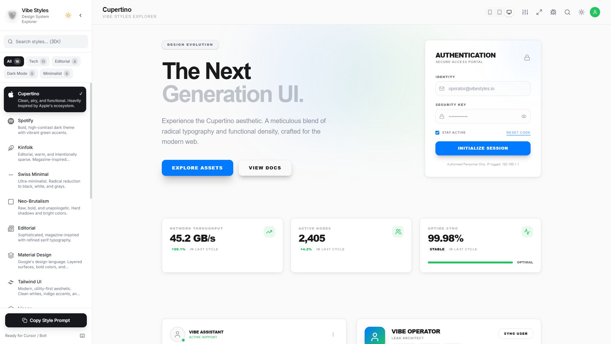

# Vibe Styles 🎨

> **The Ultimate Agentic Design System Generator**  
> Build, customize, and deploy consistent interfaces in seconds. Inspired by the world's best design systems (Linear, Apple, Spotify), refined for your next project.



## 🚀 Overview

**Vibe Styles** is not just a theme-switcher; it's a comprehensive **Design System Explorer and Generator**. It allows developers and designers to instantly "try on" different aesthetic personalities for their UI—from the stark minimalism of *Swiss Design* to the deep, glass-morphic layers of *Linear-style* dark modes.

With a powerful built-in **Theme Editor**, you can tweak every variable—colors, typography, radii, shadows—and see changes propagate instantly across complex, real-world component previews.

## ✨ Key Features

### 🎨 Visual & Aesthetic Excellence
- **Glassmorphism 2.0**: Advanced backdrop blurs, noise textures, and subtle border gradients for that premium "High-End" feel.
- **Deep Dark Mode**: Gone are flat black backgrounds. We use rich, slate-toned depths to create hierarchy and immersion.
- **Surface Elevation System**: A tiered system of shadows and borders (`Level 1` to `Level 3`) to define spatial relationships.

### 🛠️ Advanced Theme Editor
- **Precision Color Control**: HSL (Hue, Saturation, Lightness) sliders for fine-tuning exact shades, plus HEX Copy/Paste.
- **Undo/Redo History**: Fearless creativity with a full history stack. Mistakes? Just `Ctrl+Z` (or use the UI).
- **Real-time Overrides**: Modify fonts, radius, and colors and watch the entire UI adapt instantly.

### 📱 Responsive & Interactive
- **Container Queries**: Dashboard previews that intelligently adapt not just to screen size, but to their container's width.
- **Micro-interactions**: buttons that *feel* clickable (scale on press), hover-lifts, and smooth transitions powered by `framer-motion`.
- **Responsive Simulation**: Test your design on Mobile, Tablet, and Desktop viewports with a single click.

### ⚡ Developer Experience (DX)
- **One-Click Export**: Happy with your theme? Export production-ready **Tailwind Config** or **CSS Variables** instantly.
- **Command Palette (`Cmd+K`)**: Power-user access to switch themes, toggle debug mode, export code, and more.
- **Accessibility First**: Built-in Color Blindness simulators (Protanopia, Deuteranopia, etc.) to ensure your design works for everyone.

## 🏗️ Tech Stack

- **Framework**: [React](https://reactjs.org/) + [Vite](https://vitejs.dev/)
- **Styling**: [Tailwind CSS](https://tailwindcss.com/) + [Tailwind Container Queries](https://github.com/tailwindlabs/tailwindcss-container-queries)
- **State Management**: [Zustand](https://github.com/pmndrs/zustand)
- **Animation**: [Framer Motion](https://www.framer.com/motion/)
- **UI Primitives**: [Radix UI](https://www.radix-ui.com/) + [Lucide Icons](https://lucide.dev/)
- **Utilities**: [Sonner](https://sonner.emilkowal.ski/) (Toast), [cmdk](https://github.com/pacocoursey/cmdk) (Command Palette)

## 🏁 Getting Started

### Prerequisites
- Node.js (v18+)
- npm / yarn / pnpm / bun

### Installation

1. **Clone the repository**
   ```bash
   git clone https://github.com/trahoangdev/vibe-styles.git
   cd vibe-styles
   ```

2. **Install dependencies**
   ```bash
   npm install
   ```

3. **Start the development server**
   ```bash
   npm run dev
   ```

4. **Open in browser** (usually `http://localhost:5173`)

## 🎮 Usage Guide

- **Explore Styles**: Click on sidebar items (Spotify, Linear, etc.) to load their presets.
- **Edit Theme**: Open the **Editor** panel (toggle top-right) to override specific values.
- **Keyboard Shortcuts**:
    - `Cmd+K` / `Ctrl+K`: Open Command Palette.
    - `Cmd+Z` / `Cmd+Y`: Undo / Redo changes.
    - `Cmd+E`: Toggle Editor.
- **Export**: Click "Export Theme" in the Editor or Command Palette to get your code.

## 🤝 Contributing

Contributions are welcome! Please feel free to submit a Pull Request.

1. Fork the project
2. Create your feature branch (`git checkout -b feature/AmazingFeature`)
3. Commit your changes (`git commit -m 'Add some AmazingFeature'`)
4. Push to the branch (`git push origin feature/AmazingFeature`)
5. Open a Pull Request

## 📄 License

This project is licensed under the MIT License - see the [LICENSE](LICENSE) file for details.
