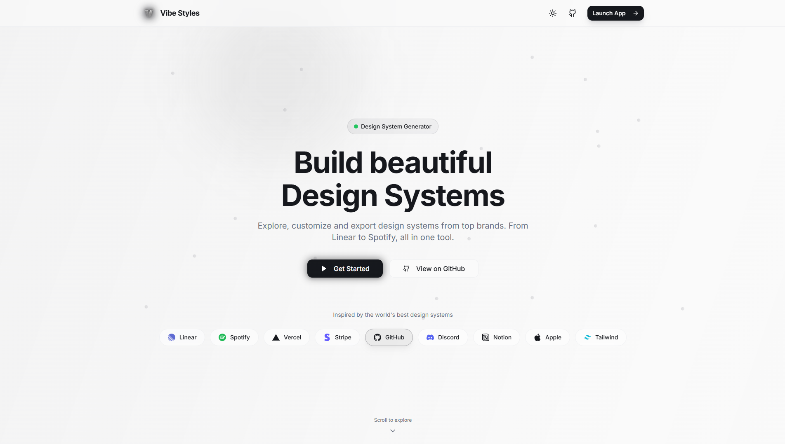

# Vibe Styles 🎨

> **The Ultimate Design System Explorer & Generator**  
> Explore 19+ design style presets, customize every detail, and export production-ready code. Inspired by Linear, Spotify, Vercel, and more.



**[Live Demo](https://vibe-styles.vercel.app)** · **[Report Bug](https://github.com/trahoangdev/vibe-styles/issues)** · **[Request Feature](https://github.com/trahoangdev/vibe-styles/issues)**

## 🚀 Overview

**Vibe Styles** is a comprehensive **Design System Explorer and Generator** that lets developers and designers instantly preview different aesthetic personalities—from Swiss minimalism to Linear's glassmorphic dark mode.

With a powerful **Theme Editor**, tweak colors, typography, radii, and shadows with real-time preview across complex UI components.

## ✨ Features

### 🎨 19+ Design Style Presets
- **Brand-inspired**: Linear, Spotify, Vercel, Stripe, GitHub, Discord, Apple, Notion
- **Classic styles**: Swiss Design, Brutalist, Glassmorphism, Neomorphism
- **Modern aesthetics**: Cyberpunk, Retro Wave, Minimal Dark

### 🛠️ Advanced Theme Editor
- **HSL Color Control** with HEX copy/paste
- **Typography customization** - fonts, weights, scale
- **Undo/Redo history** - fearless experimentation
- **Real-time preview** - instant visual feedback

### ⚡ Developer Experience
- **One-click export** - Tailwind Config or CSS Variables
- **Command Palette** (`Cmd+K`) - power-user navigation
- **Keyboard shortcuts** - efficient workflow
- **Favorites system** - bookmark your preferred styles

### 🎯 UX Excellence
- **Onboarding tour** - guided first-time experience
- **Unsaved changes warning** - never lose your work
- **Toast notifications** - clear action feedback
- **Color blindness simulation** - accessibility testing
- **Responsive preview** - Mobile, Tablet, Desktop

## 🏗️ Tech Stack

| Category | Technology |
|----------|------------|
| Framework | React 18 + Vite |
| Styling | Tailwind CSS + Container Queries |
| State | Zustand (with persist) |
| Animation | Framer Motion |
| UI | Radix UI + Lucide Icons |
| Utilities | Sonner, cmdk, react-colorful |

## 🏁 Quick Start

```bash
# Clone
git clone https://github.com/trahoangdev/vibe-styles.git
cd vibe-styles

# Install
npm install

# Run
npm run dev
```

Open `http://localhost:5173`

## ⌨️ Keyboard Shortcuts

| Shortcut | Action |
|----------|--------|
| `Cmd/Ctrl + K` | Command Palette |
| `E` | Toggle Editor |
| `F` | Toggle Fullscreen |
| `D` | Toggle Dark Mode |
| `↑` / `↓` | Navigate Styles |
| `Cmd/Ctrl + Z` | Undo |
| `Cmd/Ctrl + Y` | Redo |
| `Shift + ?` | Show Shortcuts |

## 🤝 Contributing

Contributions welcome! See [CONTRIBUTING.md](CONTRIBUTING.md) for guidelines.

```bash
# Fork → Clone → Branch → Commit → Push → PR
git checkout -b feature/amazing-feature
git commit -m 'Add amazing feature'
git push origin feature/amazing-feature
```

## 📄 License

MIT License - see [LICENSE](LICENSE)

---

**Made with ❤️ by [@trahoangdev](https://github.com/trahoangdev)**
